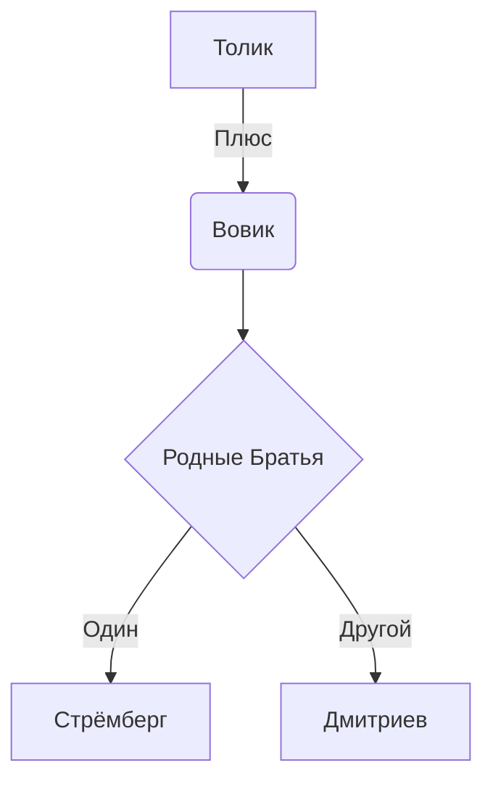
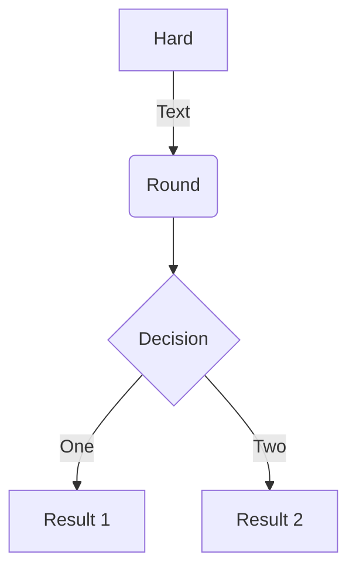
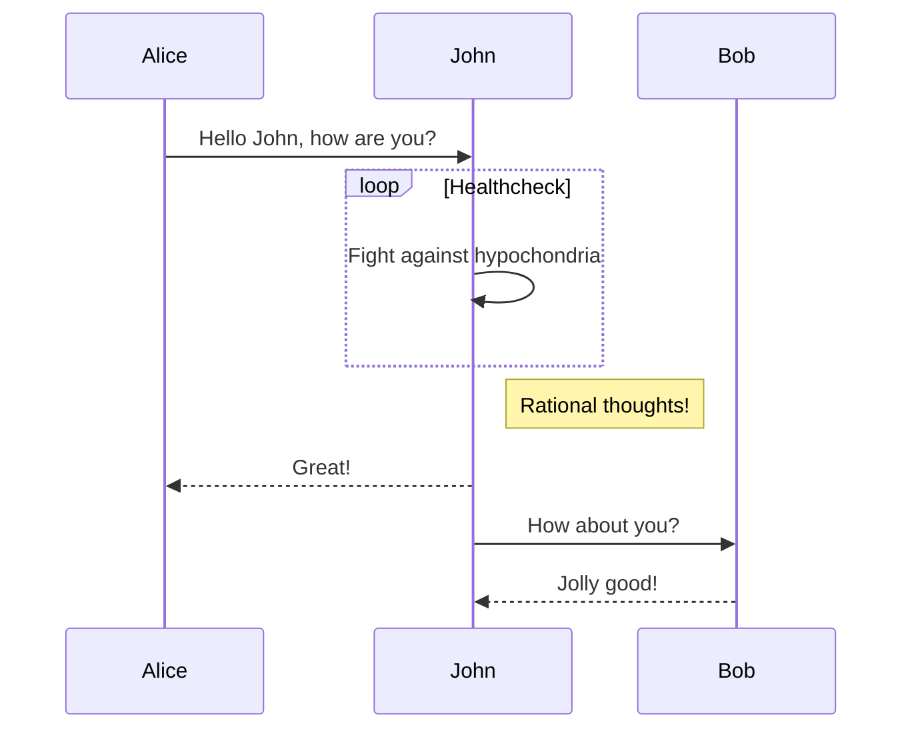
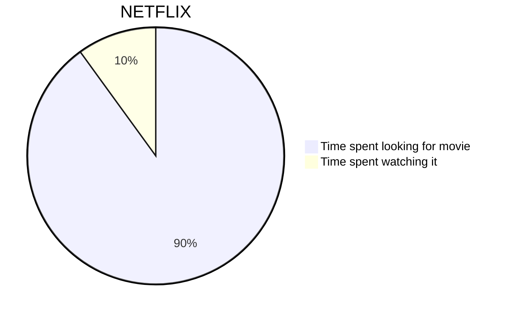

Проверка Шахматных Диаграмм
<!--more-->

**FEN**: `r1bq1rk1/p1p2pb1/1p1p3p/2nPp1p1/2P1P3/2NB1NP1/PP2QPP1/R3R1K1`

Картинка

**FEN:** `r6b/p1pq1p1k/1p2p1rp/4PpBQ/3P1P2/2PR2R1/P5PP/6K1`


**FEN**: `r1bq1rk1/p1p2pb1/1p1p3p/2nPp1p1/2P1P3/2NB1NP1/PP2QPP1/R3R1K1`


<center>Centered text</center>

An example **flowchart**:

    ```mermaid
    graph TD
    A[Толик] -->|Плюс| B(Вовик)
    B --> C{Родные Братья}
    C -->|Один| D[Стрёмберг]
    C -->|Другой| E[Дмитриев]
    ```

renders as



### Diagrams

Academic supports a Markdown extension for diagrams. You can enable this feature by toggling the `diagram` option in your `config/_default/params.toml` file or by adding `diagram: true` to your page front matter.

An example **flowchart**:

    ```mermaid
    graph TD
    A[Hard] -->|Text| B(Round)
    B --> C{Decision}
    C -->|One| D[Result 1]
    C -->|Two| E[Result 2]
    ```

renders as



An example **sequence diagram**:

    ```mermaid
    sequenceDiagram
    Alice->>John: Hello John, how are you?
    loop Healthcheck
    John->>John: Fight against hypochondria
    end
    Note right of John: Rational thoughts!
    John-->>Alice: Great!
    John->>Bob: How about you?
    Bob-->>John: Jolly good!
    ```

renders as



    ```mermaid
    pie title NETFLIX
    "Time spent looking for movie" : 90
    "Time spent watching it" : 10
    ```


